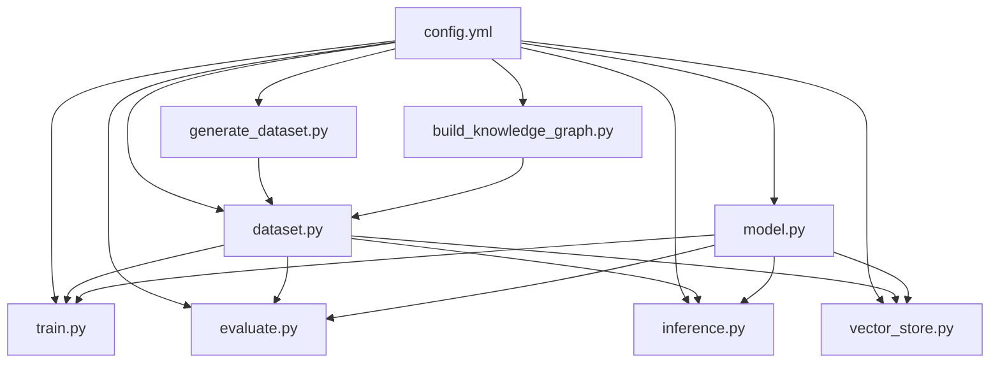

# TableSimilarity - 增强型表相似性分析系统

一个基于深度学习的表结构相似性分析系统，支持知识图谱增强、动态门控融合和多层次相似度计算。专为金融、交易等领域的数据表相似性分析而设计。

---

## 📋 目录

- [项目概述](#项目概述)
- [功能特性](#功能特性)
- [技术架构](#技术架构)
- [代码结构](#代码结构)
- [环境要求](#环境要求)
- [安装指南](#安装指南)
- [配置说明](#配置说明)
- [快速开始](#快速开始)
- [详细使用指南](#详细使用指南)
- [模型架构](#模型架构)
- [算法原理](#算法原理)
- [评估指标](#评估指标)
- [高级功能](#高级功能)
- [常见问题](#常见问题)
- [项目维护](#项目维护)

---

## 项目概述

**TableSimilarity** 是一个先进的表结构相似性分析框架，通过深度学习技术实现数据库表之间的语义相似度计算。该系统特别适用于：

- 📊 数据血缘追踪与分析
- 🔄 数据集成与Schema匹配
- 🗂️ 数据目录自动分类
- 🎯 相似数据表推荐
- 🔍 元数据管理与发现

### 核心创新点

1. **知识图谱增强**：基于领域知识图谱丰富字段语义理解
2. **动态门控融合**：自适应调整结构与内容特征权重
3. **多层次相似度**：字段级、表级、关系级多层次聚合
4. **课程学习**：从简单样本逐步学习困难样本
5. **完全配置化**：所有参数通过YAML配置，零硬编码

---

## 功能特性

### ✅ 已实现功能

- **数据生成**
  - 基于业务主题的自动表生成（金融、交易、用户等8个主题）
  - 支持同义词替换、字段缺失、额外字段等多种变体
  - 智能相似度标签计算（考虑业务域、同义词、结构重叠）
  - 硬案例表生成（困难样本）

- **知识图谱**
  - 领域知识图谱构建（业务域、数据主题、字段知识）
  - 字段语义查询与扩展
  - 中英文字段名映射
  - 业务规则与重要性评分

- **模型训练**
  - 增强型表相似性模型（配置驱动）
  - 课程学习调度器
  - 动态温度调度
  - 早停机制（无停止版）
  - 梯度裁剪与监控
  - TensorBoard集成

- **推理与评估**
  - 单表对相似度计算
  - 批量表比较
  - 相似表推荐（Top-K）
  - 向量库存储与检索（Faiss）
  - 9宫格评估可视化
  - 权重动态性分析

- **特征工程**
  - 结构特征编码（字段名、类型、注释、知识图谱增强）
  - 内容特征编码（数值、字符串、日期型分别处理）
  - 字段对齐与重要性评分
  - 图神经网络关系编码

### 🚧 计划功能

- [ ] 增量学习支持
- [ ] 多语言字段名支持
- [ ] 可视化知识图谱浏览器
- [ ] REST API服务
- [ ] 模型压缩与蒸馏
- [ ] 跨数据库类型支持

---

## 技术架构

```
┌─────────────────────────────────────────────────────────────┐
│                        用户交互层                              │
├─────────────────────────────────────────────────────────────┤
│  inference.py  │  evaluate.py  │  vector_store.py           │
├─────────────────────────────────────────────────────────────┤
│                      模型与训练层                              │
│  model.py (EnhancedTableSimilarityModel)  │  train.py        │
├─────────────────────────────────────────────────────────────┤
│                      数据处理层                                │
│  dataset.py (TableSimilarityDataset)  │  generate_dataset.py │
├─────────────────────────────────────────────────────────────┤
│                      知识增强层                                │
│         build_knowledge_graph.py  │  vector_store.py        │
├─────────────────────────────────────────────────────────────┤
│                      数据存储层                                │
│              MySQL Database  │  Faiss Index                │
└─────────────────────────────────────────────────────────────┘
```

### 核心组件

| 组件 | 文件 | 说明 |
|------|------|------|
| **模型** | `model.py` | 增强型表相似性模型定义 |
| **数据集** | `dataset.py` | 表结构数据加载与编码 |
| **训练** | `train.py` | 训练流程与调度器 |
| **评估** | `evaluate.py` | 模型评估与可视化 |
| **推理** | `inference.py` | 相似度计算与推荐 |
| **数据生成** | `generate_dataset.py` | 合成数据生成 |
| **知识图谱** | `build_knowledge_graph.py` | 领域知识构建 |
| **向量库** | `vector_store.py` | Faiss向量索引 |

---

## 代码结构

```
TableSimilarity/
├── model.py                          # 核心模型定义
├── dataset.py                        # 数据集处理
├── train.py                          # 训练脚本
├── evaluate.py                       # 评估脚本
├── inference.py                      # 推理引擎
├── generate_dataset.py               # 数据生成器
├── build_knowledge_graph.py          # 知识图谱构建
├── vector_store.py                   # 向量库管理
├── config.yml                        # 配置文件
└── README.md                         # 项目文档
```

### 文件依赖关系



---

## 环境要求

### 系统要求

- **Python**: 3.8+
- **操作系统**: Linux / macOS / Windows
- **内存**: 建议 8GB+
- **GPU**: 可选（支持CPU/GPU）

### Python依赖

```txt
torch>=1.12.0
torch-geometric>=2.1.0
numpy>=1.21.0
pandas>=1.3.0
scikit-learn>=1.0.0
PyYAML>=6.0
mysql-connector-python>=8.0.0
SQLAlchemy>=1.4.0
faiss-cpu>=1.7.0  # 或 faiss-gpu
matplotlib>=3.5.0
tqdm>=4.62.0
tensorboard>=2.8.0
networkx>=2.6.0
```

### 完整依赖列表

```bash
# requirements.txt
torch==1.13.0+cu116
torch-geometric==2.2.0
numpy==1.23.5
pandas==1.5.3
scikit-learn==1.2.2
PyYAML==6.0
mysql-connector-python==8.0.33
SQLAlchemy==2.0.0
faiss-cpu==1.7.4
matplotlib==3.7.1
tqdm==4.65.0
tensorboard==2.13.0
networkx==3.1
```

---

## 安装指南

### 方式一：快速安装

```bash
# 克隆项目
git clone https://github.com/your-username/TableSimilarity.git
cd TableSimilarity

# 创建虚拟环境
python -m venv venv
source venv/bin/activate  # Windows: venv\Scripts\activate

# 安装依赖
pip install -r requirements.txt
```

### 方式二：分步安装

```bash
# 1. 安装PyTorch（根据CUDA版本选择）
pip install torch torchvision torchaudio --index-url https://download.pytorch.org/whl/cu118

# 2. 安装PyTorch Geometric
pip install pyg-lib torch-scatter torch-sparse torch-cluster torch-spline-conv -f https://data.pyg.org/whl/torch-2.0.0+cu118.html
pip install torch-geometric

# 3. 安装其他依赖
pip install numpy pandas scikit-learn PyYAML mysql-connector-python SQLAlchemy faiss-cpu matplotlib tqdm tensorboard networkx
```

### 方式三：Conda环境

```bash
# 创建Conda环境
conda create -n tablesim python=3.10
conda activate tablesim

# 安装依赖
conda install pytorch torchvision torchaudio pytorch-cuda=11.7 -c pytorch -c nvidia
pip install torch-geometric
pip install -r requirements.txt
```

---

## 配置说明

### config.yml 结构

```yaml
# MySQL数据库配置
mysql:
  host: localhost
  port: 3306
  user: root
  password: your_password
  database: table_similarity

# 数据配置
data:
  kg_path: data/knowledge_graph.graphml
  train_annotations: data/train_annotations.json
  val_annotations: data/val_annotations.json
  test_annotations: data/test_annotations.json

# 数据生成配置
data_generation:
  samples_per_table: 1000
  base_tables_per_theme: 5
  variations_per_table: 3
  min_fields_per_table: 5
  max_fields_per_table: 15
  synonym_prob: 0.3
  extra_field_prob: 0.3
  missing_field_prob: 0.2
  similarity_thresholds:
    high: 0.8
    medium: 0.6
    low: 0.3
    hard_min: 0.4
    hard_max: 0.6

# 模型配置
model:
  input_dims:
    field: 39
    content: 32
  embedding_dims:
    struct: 128
    content: 128
    fused: 128
  structure_encoder:
    num_layers: 2
    num_heads: 4
    hidden_dim: 256
    dropout: 0.1
    use_pos_encoding: true
  field_relation_gnn:
    num_heads: 4
    num_layers: 2
    dropout: 0.1
    edge_threshold: 0.3
  adaptive_attention:
    num_heads: 4
    dropout: 0.1
    hidden_dim: 512
  dynamic_gate:
    hidden_dim: 128
  loss_weights:
    mse: 1.0
    contrast: 0.2
    base: 0.7
    multi: 0.3
  regularization:
    l2_weight: 0.001

# 训练配置
training:
  epochs: 20
  batch_size: 32
  learning_rate: 1e-3
  weight_decay: 1e-4
  save_path: models/best_model.pth
  early_stopping:
    enabled: true
    patience: 10
    delta: 0.001
    save_path: models/best_model.pth
  lr_scheduler:
    type: CosineAnnealingLR
    T_max: 20
    gamma: 0.5
  temperature_scheduler:
    enabled: true
    initial_temp: 0.07
    final_temp: 0.04
    decay_epochs: 7
  curriculum_learning:
    enabled: true
    start_threshold: 0.7
    end_threshold: 0.0
    transition_epochs: 5
  gradient_clip:
    enabled: true
    max_norm: 10.0
  logging:
    tensorboard_dir: runs/
    log_interval: 20

# 向量库配置
vector_store:
  path: data/vector_store.index

# TF-IDF配置
tfidf:
  max_features: 50
  analyzer: char
  ngram_range: [2, 3]

# 设备配置
device:
  auto_select: true
  cuda_device: 0
```

### 配置项说明

| 配置项 | 类型 | 默认值 | 说明 |
|--------|------|--------|------|
| `mysql.host` | string | localhost | MySQL服务器地址 |
| `mysql.port` | int | 3306 | MySQL端口 |
| `mysql.user` | string | root | 数据库用户名 |
| `mysql.password` | string | - | 数据库密码 |
| `mysql.database` | string | table_similarity | 数据库名称 |
| `data_generation.samples_per_table` | int | 1000 | 每张表生成的记录数 |
| `data_generation.base_tables_per_theme` | int | 5 | 每个主题的基础表数量 |
| `model.input_dims.field` | int | 39 | 字段特征输入维度 |
| `model.input_dims.content` | int | 32 | 内容特征输入维度 |
| `model.embedding_dims.fused` | int | 128 | 融合嵌入维度 |
| `training.epochs` | int | 20 | 训练轮数 |
| `training.batch_size` | int | 32 | 批次大小 |
| `training.learning_rate` | float | 1e-3 | 学习率 |
| `training.save_path` | string | models/best_model.pth | 模型保存路径 |
| `vector_store.path` | string | data/vector_store.index | 向量库路径 |

---

## 快速开始

### 1. 准备配置文件

```bash
# 复制配置文件模板
cp config.template.yml config.yml

# 编辑配置文件
vim config.yml  # 修改MySQL密码等配置
```

### 2. 创建数据库

```sql
-- 登录MySQL
mysql -u root -p

-- 创建数据库
CREATE DATABASE table_similarity DEFAULT CHARACTER SET utf8mb4;

-- 授权（可选）
GRANT ALL PRIVILEGES ON table_similarity.* TO 'root'@'localhost';
FLUSH PRIVILEGES;
```

### 3. 生成数据集

```bash
# 生成训练、验证、测试数据
python generate_dataset.py

# 查看生成的表
python -c "import mysql.connector; conn = mysql.connector.connect(host='localhost', user='root', password='your_password', database='table_similarity'); cursor = conn.cursor(); cursor.execute('SHOW TABLES'); print(f'共{cursor.fetchall()}个表'); conn.close()"
```

### 4. 构建知识图谱

```bash
# 构建领域知识图谱
python build_knowledge_graph.py

# 查询字段知识（示例）
python build_knowledge_graph.py --query currency_code --lang en
```

### 5. 训练模型

```bash
# 开始训练
python train.py --config config.yml --epochs 20

# 使用自定义参数
python train.py --config config.yml --epochs 30 --batch_size 64 --lr 1e-4
```

### 6. 评估模型

```bash
# 评估模型性能
python evaluate.py --model_path models/best_model.pth

# 查看评估可视化结果
evaluation_results_enhanced.png
```

### 7. 构建向量库

```bash
# 构建Faiss向量库
python vector_store.py --rebuild

# 测试向量库
python vector_store.py --test finance_0_base
```

### 8. 推理演示

```bash
# 启动推理演示
python inference.py

# 计算指定表对相似度
python inference.py --table_a finance_0_base --table_b finance_1_base

# 推荐相似表
python inference.py --recommend finance_0_base --top_k 5
```

---

## 详细使用指南

### 数据生成详解

#### generate_dataset.py

**功能**：生成多样化的合成数据表，用于训练和测试

**核心方法**：

```python
# 生成大规模表
python generate_dataset.py

# 查看生成统计
```

**生成策略**：

1. **基础表** (`base`): 标准字段组合
2. **同义字段表** (`synonym`): 字段名替换为同义词
3. **额外字段表** (`extra`): 添加冗余字段
4. **字段缺失表** (`missing`): 部分核心字段缺失
5. **硬案例表** (`hard_case_*`): 困难样本对

**业务主题**：

- `finance`: 金融交易
- `trade`: 贸易订单
- `user`: 用户信息
- `inventory`: 库存管理
- `payment`: 支付记录
- `customer`: 客户详情
- `product`: 产品信息
- `logistics`: 物流配送

**字段模板**：

| 字段名 | 类型 | 描述 | 同义词 |
|--------|------|------|--------|
| `currency_code` | VARCHAR(10) | 货币代码 | fx_code, cur_code, ccy |
| `exchange_rate` | DECIMAL(20,6) | 汇率 | fx_rate, conversion_rate |
| `date` | DATE | 交易日期 | trans_date, value_date |
| `amount` | DECIMAL(20,2) | 交易金额 | tx_amount, amt, sum |
| `account_id` | BIGINT | 账户ID | acct_id, acc_id, client_id |
| `status` | VARCHAR(20) | 记录状态 | state, record_status |

### 知识图谱构建

#### build_knowledge_graph.py

**核心方法**：

```python
# 构建知识图谱
build_knowledge_graph(config_path: str) -> nx.DiGraph

# 查询字段知识
query_field_knowledge(G, field_name: str, language: str = "en") -> Dict

# 扩展字段语义
expand_field_semantics(G, field_name: str, top_k: int = 5) -> List[str]
```

**知识图谱结构**：

```
业务域 (Domain)
    ↓ 包含
数据主题 (Theme)
    ↓ 属于
字段 (Field)
    ↓ 关联
相关概念、业务规则、重要性评分
```

**示例查询**：

```bash
# 查询currency_code的语义知识
python build_knowledge_graph.py --query currency_code

# 中文查询
python build_knowledge_graph.py --query 货币代码 --lang zh
```

**输出示例**：

```json
{
  "description": "货币代码，如CNY代表人民币，USD代表美元",
  "related_concepts": ["货币", "汇率", "国际结算", "ISO4217"],
  "business_rules": ["ISO 4217标准", "3位大写字母"],
  "importance_score": 0.95,
  "chinese_name": "货币代码"
}
```

### 模型训练

#### train.py

**训练流程**：

```
1. 加载配置 → 初始化模型
2. 构建数据加载器 → 训练/验证集
3. 设置优化器 → AdamW + 学习率调度
4. 开始训练循环
   - 课程学习过滤
   - 前向传播
   - 损失计算
   - 反向传播 + 梯度裁剪
   - 参数更新
5. 验证评估
6. 早停检查
7. 模型保存
```

**训练参数**：

```bash
python train.py \
    --config config.yml \
    --epochs 20 \
    --batch_size 32 \
    --lr 1e-3
```

**训练组件**：

| 组件 | 说明 |
|------|------|
| `EarlyStoppingWithoutStop` | 无停止早停，仅保存最佳模型 |
| `TemperatureScheduler` | 动态温度调度（对比学习） |
| `CurriculumScheduler` | 课程学习调度 |
| `train_epoch` | 单轮训练（带指标计算） |
| `validate_epoch` | 单轮验证 |

**训练输出**：

```
Epoch 1/20 | 阈值: 0.70 | 温度: 0.0700
------------------------------------------------------------
Epoch 1 训练: 100%|████████████| 50/50 [00:12<00:00,  3.92it/s, Loss=0.2345, Acc=78.12%, StructW=0.52, ContentW=0.48]

============================================================
【Epoch 1 训练总结】
📊 Loss: 0.2345 | Acc: 78.12% | F1: 0.7812 | AUC: 0.8234
🎯 结构权重: 0.523±0.125
🎯 内容权重: 0.477±0.125
🧠 梯度范数: 2.345
============================================================
```

### 模型评估

#### evaluate.py

**评估指标**：

| 类型 | 指标 | 说明 |
|------|------|------|
| 回归 | MAE, RMSE | 平均绝对误差、均方根误差 |
| 分类 | Accuracy, F1, Precision, Recall | 分类准确率、F1分数等 |
| 排序 | Recall@K, Precision@K | Top-K召回率和精确率 |
| 高级 | ROC-AUC, mAP, nDCG | ROC曲线下面积、平均精度等 |
| 诊断 | 权重动态性 | 门控网络权重标准差 |

**可视化图表**（9宫格）：

1. **相似度分布对比**：真实vs预测
2. **Precision-Recall曲线**：分类性能
3. **ROC曲线**：二分类性能
4. **门控权重分布**：结构vs内容权重
5. **权重-相似度散点图**：相关性分析
6. **Recall@K曲线**：排序性能
7. **关键指标雷达图**：综合评估
8. **预测误差分布**：误差分析
9. **核心指标柱状图**：汇总展示

**评估命令**：

```bash
# 评估模型
python evaluate.py --model_path models/best_model.pth

# 查看评估报告
evaluation_results_enhanced.png
```

### 推理引擎

#### inference.py

**核心功能**：

```python
# 计算表对相似度
compute_table_similarity(table_a_name: str, table_b_name: str) -> float

# 推荐相似表
recommend_similar_tables(table_name: str, top_k: int = 5) -> List[Dict]

# 批量比较
batch_compare(table_name: str, candidate_tables: List[str]) -> List[Tuple[str, float]]
```

**使用示例**：

```python
from inference import TableSimilarityInference

# 初始化推理引擎
infer = TableSimilarityInference(
    model_path="models/best_model.pth",
    config_path="config.yml"
)

# 计算相似度
similarity = infer.compute_table_similarity("finance_0_base", "finance_1_base")
print(f"相似度: {similarity:.4f}")

# 推荐相似表
results = infer.recommend_similar_tables("finance_0_base", top_k=5)
for rec in results:
    print(f"{rec['table_name']}: {rec['similarity']:.4f}")
```

**命令行使用**：

```bash
# 计算指定表对
python inference.py --table_a finance_0_base --table_b finance_1_base

# 推荐相似表
python inference.py --recommend finance_0_base --top_k 5

# 启动演示
python inference.py
```

### 向量库管理

#### vector_store.py

**核心方法**：

```python
# 构建向量库
build_vector_store()

# 加载向量库
load_vector_store() -> bool

# 搜索相似表
search_similar_tables(table_name: str, top_k: int = 10) -> List[Dict]

# 批量搜索所有表对
batch_search_all_pairs(top_k: int = 10) -> List[Dict]
```

**构建流程**：

```
1. 连接MySQL获取所有表
2. 加载模型
3. 对每个表：
   - 加载表结构
   - 编码结构特征
   - 编码内容特征
   - 生成融合向量
   - 添加到Faiss索引
4. 保存索引和映射文件
```

**使用命令**：

```bash
# 构建向量库
python vector_store.py --rebuild

# 测试查询
python vector_store.py --test finance_0_base

# 批量分析
python vector_store.py
```

---

## 模型架构
核心原理暂不公开，后续会上传模型权重文件

## 算法原理

### 相似度计算

#### 1. 结构相似度

基于字段名、数据类型、字段顺序的相似性：

```python
similarity_structure = w_name * name_sim + w_type * type_sim + w_order * order_sim
```

- **名称相似度**: 字符串编辑距离 + 子串匹配
- **类型相似度**: 类型映射表匹配
- **顺序相似度**: 最长公共子序列比率

#### 2. 内容相似度

基于数据分布的统计特征相似性：

```python
similarity_content = cosine_similarity(content_vec_a, content_vec_b)
```

**内容特征提取**：

| 数据类型 | 特征 | 维度 |
|----------|------|------|
| 数值型 | 均值、方差、分位数、偏度、峰度 | 13 |
| 字符串型 | TF-IDF均值、长度均值、唯一值比率 | 25 |
| 日期型 | 格式特征、时间间隔、范围 | 14 |

#### 3. 语义相似度

基于知识图谱的语义增强：

```python
similarity_semantic = kg_enhancement(field_descriptions, business_domains)
```

**增强方式**：

- 同义词映射（currency_code ↔ fx_code）
- 业务域匹配（同域加权）
- 相关概念重叠度

### 损失函数

#### ContinuousSimilarityLoss

**组成**：

```python
total_loss = w_mse * mse_loss + w_contrast * contrast_loss
```

1. **MSE损失**：精确拟合相似度值

```python
mse_loss = F.mse_loss(pred_sim, labels)
```

2. **对比损失**：保持相对顺序

```python
# 只惩罚严重顺序错误
sign_mismatch = sign(label_diff) * sign(pred_diff) < 0
magnitude_large = abs(label_diff) > 0.3
contrast_mask = sign_mismatch & magnitude_large

contrast_loss = relu(0.1 - pred_diff * sign(label_diff))
contrast_loss = (contrast_loss * contrast_mask).mean()
```

3. **困难样本加权**：模糊区间样本权重×2

```python
hard_mask = (labels >= 0.4) & (labels <= 0.6)
hard_weights = torch.ones_like(labels)
hard_weights[hard_mask] = 2.0
weighted_mse = (mse_loss * hard_weights).mean()
```

### 课程学习

**CurriculumScheduler** 实现：

```python
# 初始阶段：只学习高相似度样本（>0.7）
start_threshold = 0.7

# 逐步降低阈值，引入困难样本
end_threshold = 0.0

# 线性过渡
current_threshold = start_threshold - (start_threshold - end_threshold) * (epoch / transition_epochs)
```

**作用**：

- 稳定训练，避免早期梯度混乱
- 逐步提升模型泛化能力
- 特别适合困难负样本

### 动态温度调度

**TemperatureScheduler** 实现：

```python
# 初始温度较高（0.07）
initial_temp = 0.07

# 逐步降低温度（0.04）
final_temp = 0.04

current_temp = initial_temp * (1 - ratio) + final_temp * ratio
```

**作用**：

- 早期：温度高，分布更平滑，易学习
- 后期：温度低，分布更尖锐，精细优化

---

## 评估指标

### 回归指标

| 指标 | 公式 | 说明 |
|------|------|------|
| **MAE** | $\frac{1}{N}\sum_{i=1}^{N}|y_i - \hat{y}_i|$ | 平均绝对误差 |
| **RMSE** | $\sqrt{\frac{1}{N}\sum_{i=1}^{N}(y_i - \hat{y}_i)^2}$ | 均方根误差 |

### 分类指标

| 指标 | 公式 | 说明 |
|------|------|------|
| **Accuracy** | $\frac{TP+TN}{TP+TN+FP+FN}$ | 准确率 |
| **Precision** | $\frac{TP}{TP+FP}$ | 精确率 |
| **Recall** | $\frac{TP}{TP+FN}$ | 召回率 |
| **F1-Score** | $2 \cdot \frac{Precision \cdot Recall}{Precision + Recall}$ | F1分数 |
| **ROC-AUC** | $\int_0^1 TPR(FPR^{-1}(x))dx$ | ROC曲线下面积 |

### 排序指标

#### Recall@K

```
Recall@K = (检索到的相关表数) / (总相关表数)
```

#### Precision@K

```
Precision@K = (检索到的相关表数) / K
```

#### Mean Average Precision (mAP)

```
mAP@K = (1/|Q|) * Σ_q (1/m_q) * Σ_{k=1}^{K} P_q(k) * rel_q(k)
```

#### Normalized Discounted Cumulative Gain (nDCG)

```
DCG@K = Σ_{i=1}^{K} (2^{rel_i} - 1) / log_2(i + 1)
nDCG@K = DCG@K / IDCG@K
```

### 权重动态性指标

| 指标 | 说明 | 正常范围 |
|------|------|----------|
| **Weight Std** | 门控权重标准差 | > 0.1 |
| **Struct Weight Mean** | 结构权重均值 | 0.3 - 0.7 |
| **Content Weight Mean** | 内容权重均值 | 0.3 - 0.7 |
| **Sim-Weight Correlation** | 权重-相似度相关性 | > 0.2 |

---

## 高级功能

### 知识图谱增强

**字段语义丰富**：

```python
def _query_kg_from_graph(self, field_name: str, original_comment: str) -> Dict:
    """从知识图谱查询并丰富注释"""
    # 1. 精确匹配
    node_id = f"field_{field_name}"
    if node_id in self.kg:
        node_data = self.kg.nodes[node_id]
        kg_description = node_data.get('description', '')
        enriched_description = f"{original_comment}; {kg_description}".strip('; ')
        return {
            'description': enriched_description,
            'related_concepts': node_data.get('related_concepts', ''),
            'business_rules': node_data.get('business_rules', '')
        }
    
    # 2. 模糊匹配
    for node in self.kg.nodes():
        if (self.kg.nodes[node].get('type') == '字段' and 
            field_name.lower() in self.kg.nodes[node].get('name', '').lower()):
            # ...
```

**重要性加权**：

```python
# 业务重要性评分
kg_importance = len(kg_info['related_concepts'].split(',')) * 0.1

# 对齐评分
alignment_score = self._compute_alignment_score(field_name, field_type, reference_table)

# 全局重要性
global_score = global_importance.get(field_name, 0.5)

# 动态权重
field_weight = kg_importance * alignment_score * global_score
field_weight = min(field_weight, 1.0)
```

### 向量库存储

**Faiss索引构建**：

```python
# 初始化索引
self.index = faiss.IndexFlatIP(self.dim)  # 内积相似度

# 添加向量
vectors = np.array(all_vectors).astype(np.float32)
self.index.add(vectors)

# 保存索引
faiss.write_index(self.index, self.index_path)
```

**相似度搜索**：

```python
# 查询向量
query_vector = self.index.reconstruct(query_id)

# 搜索
distances, indices = self.index.search(
    np.array([query_vector]).astype(np.float32),
    k
)

# 映射回表名
results = []
for idx in indices[0]:
    table_name = self.table_mapping[idx]
    similarity = distances[0][i]
    results.append({'table_name': table_name, 'similarity': similarity})
```

### 可视化分析

**9宫格评估图**：

1. **相似度分布对比**：验证模型校准
2. **PR曲线**：评估排序性能
3. **ROC曲线**：评估分类性能
4. **权重分布**：检查动态性
5. **权重-相似度相关性**：验证门控有效性
6. **Recall@K曲线**：评估检索性能
7. **雷达图**：综合指标展示
8. **误差分布**：诊断训练问题
9. **柱状图**：核心指标汇总

**训练曲线**：

- Loss变化曲线（训练/验证）
- 准确率变化曲线
- ROC-AUC变化曲线
- F1-Score变化曲线

---

## 常见问题

### Q1: MySQL连接失败

**问题**：`mysql.connector.Error: Can't connect to MySQL server`

**解决方案**：

```bash
# 1. 检查MySQL服务
sudo systemctl status mysql  # Linux
brew services list | grep mysql  # macOS

# 2. 检查配置
# 编辑 config.yml
mysql:
  host: localhost
  port: 3306
  user: root
  password: your_password  # 修改这里
  database: table_similarity

# 3. 测试连接
mysql -u root -p -e "SHOW DATABASES;"
```

### Q2: 模型训练时Loss为NaN

**问题**：`Loss = nan` 或 `Loss = inf`

**解决方案**：

```yaml
# 1. 降低学习率
training:
  learning_rate: 1e-4  # 从1e-3降低

# 2. 增加梯度裁剪
training:
  gradient_clip:
    enabled: true
    max_norm: 5.0  # 从10.0降低

# 3. 检查数据
# 确保相似度标签在[0, 1]范围内
```

### Q3: 权重动态性过低（Weight Std < 0.1）

**问题**：门控网络未动态调整

**解决方案**：

```yaml
# 1. 检查DynamicPairGating输入
# 确保table_sim信号正常

# 2. 调整门控隐藏层维度
model:
  dynamic_gate:
    hidden_dim: 256  # 从128增加

# 3. 增加训练数据多样性
```

### Q4: Recall@10过低（< 0.05）

**问题**：模型过于保守

**解决方案**：

```yaml
# 1. 降低温度参数
model:
  contrastive_loss:
    temperature: 0.05  # 从0.07降低

# 2. 调整损失权重
model:
  loss_weights:
    contrast: 0.5  # 从0.2增加
```

### Q5: 向量库构建失败

**问题**：`没有任何表成功编码`

**解决方案**：

```bash
# 1. 检查MySQL中是否有表
python -c "
import mysql.connector
conn = mysql.connector.connect(host='localhost', user='root', password='pwd', database='table_similarity')
cursor = conn.cursor()
cursor.execute('SHOW TABLES')
print(f'表数量: {len(cursor.fetchall())}')
conn.close()
"

# 2. 重新生成数据
python generate_dataset.py

# 3. 检查模型文件
ls -lh models/best_model.pth
```

### Q6: GPU内存不足

**问题**：`RuntimeError: CUDA out of memory`

**解决方案**：

```yaml
# 1. 减小批次大小
training:
  batch_size: 16  # 从32降低

# 2. 减小嵌入维度
model:
  embedding_dims:
    struct: 64  # 从128降低
    content: 64
    fused: 64

# 3. 使用CPU训练
# 编辑 config.yml
device:
  auto_select: false
```

### Q7: 中文乱码

**问题**：图表中文显示为方框

**解决方案**：

```python
# 已在代码中配置
import matplotlib.pyplot as plt

plt.rcParams['font.sans-serif'] = ['SimHei', 'Arial Unicode MS', 'DejaVu Sans']
plt.rcParams['axes.unicode_minus'] = False
```

如果仍然乱码，安装中文字体：

```bash
# Ubuntu/Debian
sudo apt-get install fonts-noto-cjk

# macOS
brew install font-noto-sans-cjk
```

---

## 项目维护

### 目录结构建议

```
TableSimilarity/
├── src/                          # 源代码
│   ├── model.py
│   ├── dataset.py
│   ├── train.py
│   ├── evaluate.py
│   ├── inference.py
│   ├── generate_dataset.py
│   ├── build_knowledge_graph.py
│   └── vector_store.py
├── config/                       # 配置文件
│   ├── config.yml
│   └── config.template.yml
├── data/                         # 数据文件
│   ├── knowledge_graph.graphml
│   ├── knowledge_graph.pkl
│   ├── vector_store.index
│   ├── table_mapping.pkl
│   └── reverse_mapping.pkl
├── models/                       # 模型文件
│   ├── best_model.pth
│   └── checkpoint_*.pth
├── notebooks/                    # Jupyter notebooks
├── tests/                        # 单元测试
├── docs/                         # 文档
├── scripts/                      # 脚本
│   ├── setup_database.sh
│   └── run_pipeline.sh
├── requirements.txt
├── README.md
└── LICENSE
```

### 性能优化建议

1. **数据加载优化**
   - 使用多进程DataLoader
   - 预加载常用表到内存
   - 缓存编码结果

2. **模型推理优化**
   - 批量推理
   - 模型量化（INT8）
   - ONNX导出

3. **向量库优化**
   - 使用IVF索引（大数据集）
   - 分片存储
   - 增量更新

4. **数据库优化**
   - 添加索引
   - 分区存储
   - 连接池

### 扩展建议

1. **支持更多数据库类型**
   - PostgreSQL
   - Oracle
   - SQL Server

2. **多语言支持**
   - 英文字段名
   - 日文字段名

3. **领域扩展**
   - 医疗领域
   - 电商领域
   - 物联网领域

4. **模型改进**
   - Transformer替代GNN
   - 对比学习增强
   - 多任务学习

---

## 许可证

本项目采用 MIT 许可证。

```
MIT License

Copyright (c) 2024 TableSimilarity

Permission is hereby granted, free of charge, to any person obtaining a copy
of this software and associated documentation files (the "Software"), to deal
in the Software without restriction, including without limitation the rights
to use, copy, modify, merge, publish, distribute, sublicense, and/or sell
copies of the Software, and to permit persons to whom the Software is
furnished to do so, subject to the following conditions:

The above copyright notice and this permission notice shall be included in all
copies or substantial portions of the Software.

THE SOFTWARE IS PROVIDED "AS IS", WITHOUT WARRANTY OF ANY KIND, EXPRESS OR
IMPLIED, INCLUDING BUT NOT LIMITED TO THE WARRANTIES OF MERCHANTABILITY,
FITNESS FOR A PARTICULAR PURPOSE AND NONINFRINGEMENT. IN NO EVENT SHALL THE
AUTHORS OR COPYRIGHT HOLDERS BE LIABLE FOR ANY CLAIM, DAMAGES OR OTHER
LIABILITY, WHETHER IN AN ACTION OF CONTRACT, TORT OR OTHERWISE, ARISING FROM,
OUT OF OR IN CONNECTION WITH THE SOFTWARE OR THE USE OR OTHER DEALINGS IN THE
SOFTWARE.
```

---

## 贡献指南

欢迎提交Issue和Pull Request！

### 开发流程

1. Fork本项目
2. 创建特性分支 (`git checkout -b feature/AmazingFeature`)
3. 提交更改 (`git commit -m 'Add some AmazingFeature'`)
4. 推送到分支 (`git push origin feature/AmazingFeature`)
5. 创建Pull Request

### 代码规范

- 使用Python类型注解
- 遵循PEP 8规范
- 添加单元测试
- 更新文档

---

## 联系方式

- **项目地址**: https://github.com/your-username/TableSimilarity
- **问题反馈**: https://github.com/your-username/TableSimilarity/issues
- **邮箱**: your.email@example.com

---

## 致谢

感谢以下开源项目：

- [PyTorch](https://pytorch.org/) - 深度学习框架
- [PyTorch Geometric](https://pyg.org/) - 图神经网络库
- [Faiss](https://github.com/facebookresearch/faiss) - 向量检索库
- [NetworkX](https://networkx.org/) - 图论与复杂网络
- [scikit-learn](https://scikit-learn.org/) - 机器学习工具包

---

## 版本历史

### v1.0.0 (2025-12-28)

- ✨ 初始版本发布
- ✨ 增强型表相似性模型
- ✨ 知识图谱增强
- ✨ 动态门控融合
- ✨ 多层次相似度聚合
- ✨ 课程学习
- ✨ 完整评估体系
- ✨ 向量库存储与检索

---

**🎉 感谢使用 TableSimilarity！**
